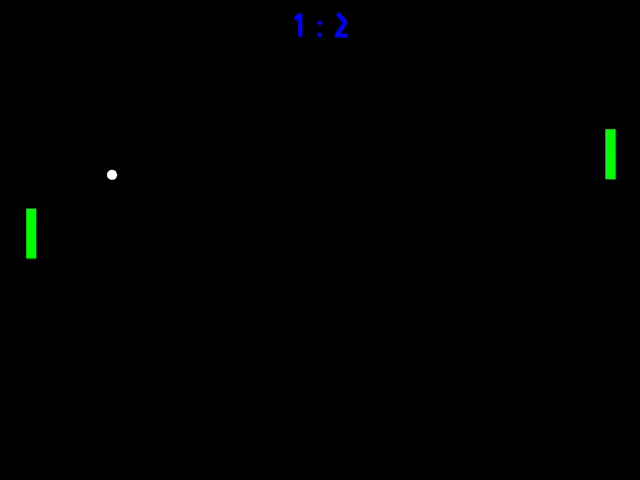
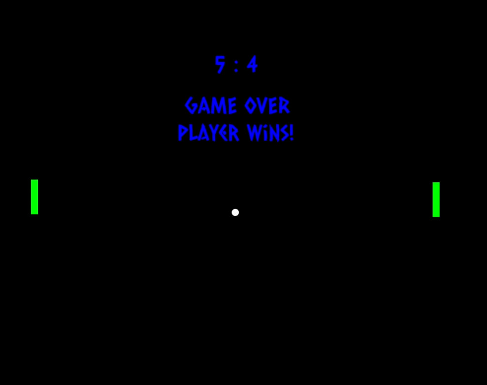

# 🎮 Pong Game

A classic **Pong** game with AI opponent, built from scratch in **C++17** using **SFML 3.0**.


---

## ✨ Features

- **AI Opponent** with realistic behavior (tracks ball position with dead-zone)
- **Physics-based ball movement** with angle-dependent paddle collision
- **Score tracking** (first to 5 points wins)
- **Game Over screen** with winner announcement
- **Randomized ball angles** after each goal
- **Delta time** for frame-independent movement

---

## 🎥 Demo





---

## 🛠 Tech Stack

- **C++17** (OOP, STL, smart pointers)
- **SFML 3.0.2** (graphics, window management, events)
- **Visual Studio 2022** (MSVC compiler)

---

## 🏗 Architecture

```
PongGame/
├── Game.h / Game.cpp        # Main game class (game loop, logic, rendering)
├── Paddle.h                 # Paddle class (movement, clamping)
├── Ball.h                   # Ball class (physics, collision detection)
├── PongGame.cpp             # Entry point (main)
└── Fonts/                   # Assets
```

**Design Patterns:**
- Game Loop Pattern
- Encapsulation (each class handles its own logic)
- RAII (`std::unique_ptr` for resource management)

---

## 🚀 How to Run

### Requirements
- **Windows 10/11 x64**
- **Visual Studio 2022** with:
  - Desktop development with C++
  - CMake tools for Windows
- **Git** (with support for submodules)

### Step 1: Clone with Submodules
```
git clone --recursive https://github.com/kazureiaoki/PongGame.git
cd PongGame
```

> **Important:** Use `--recursive` to automatically download SFML as a submodule.

### Step 2: Generate Project with CMake
```
cmake -S . -B build -A x64
```

This will create a `build/` folder with the Visual Studio solution.

### Step 3: Open in Visual Studio
```
start build\PongGame.sln
```

Or manually: Open `build/PongGame.sln` in Visual Studio 2022.

### Step 4: Build and Run
1. Switch to **Release | x64** configuration
2. Right-click on **PongGame** → **Set as Startup Project**
3. Press **F5** (or **Ctrl+F5** to run without debugging)

The game will launch in a 1280x960 window.

---

## 📦 Archive Distribution

If you're distributing the project as a `.zip`:
- Include the `external/SFML/` folder (or instruct users to run `git submodule update --init --recursive` after extracting)
- CMake will automatically configure SFML during the build process

---

## 🛠 Technical Details

- **SFML Version:** 2.6.2 (managed via Git Submodule)
- **Build System:** CMake 3.16+
- **Compiler:** MSVC 2022 (C++17)
- **Graphics Library:** SFML (statically linked)

Dependencies are managed through Git submodules — no manual installation required.

---

## 🎮 Controls

| Key | Action |
|-----|--------|
| **W** | Move player paddle up |
| **S** | Move player paddle down |

---

## 📚 What I Learned

- Implementing a **game loop** with delta time
- **Collision detection** and response (angle-based bouncing)
- Working with **external libraries** (SFML)
- Managing resources with **smart pointers** (`std::unique_ptr`)
- Structuring code with **OOP principles**

---

## 🎯 Future Improvements

- [ ] Main menu (Start/Settings/Quit)
- [ ] Local multiplayer (2 players)
- [ ] Sound effects (paddle hit, goal scored)
- [ ] Particle effects for ball trail
- [ ] Adjustable AI difficulty

---

## 📄 License

This project was created as a technical assignment for a Junior C++ Developer position.  
Feel free to use it for learning purposes.

---

## 📧 Contact

**Author:** Daniella 

**LinkedIn:** https://www.linkedin.com/in/daniellatskhovriebova/ 

**Email:** daniellatskho@gmail.com

---

⭐ **If you like this project, give it a star!**

